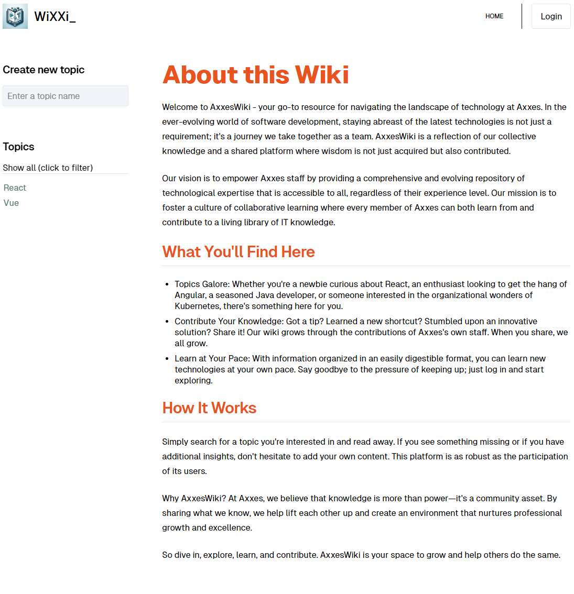

# Excercise 2

Onderdelen die we aan gaan maken:

- `layout.svelte`
- `layout.ts`
- Add routing for topics and topic creation
- Article header buttons logic
- Render article with SvelteMarkdown
- Article draft handling
- Article publish handling
- (extra) Prerendering

## Layout.svelte



Maak een `+layout.svelte` die de header, topicsList, footer en een `<slot />` voor de content bevat. Hierdoor blijft er enkel nog de homepage text over in de `+page.svelte`.

## layout(.server).ts

Exporteer een load functie die de topics ophaalt uit de `getTopics` service zodat je deze kunt gebruiken in je `+layout.svelte` component.

Voeg een data prop toe aan de `+layout.svelte` als volgt om ervoor te zorgen dat het datatype automatisch uit de `layout.(server.)ts` wordt gehaald:

```ts
export let data: Awaited<ReturnType<typeof load>>;
```

## Voeg routing toe naar `article/[topic]`

Voeg anchor tags toe met de correcte href om te navigeren naar de juiste pagina. Ook bij het aanmaken van een nieuw topic moet er vanuit de ts code genavigeerd worden naar de edit pagina.

## Article headers button logic


Boven de artikelen (in view modus) staan er een aantal knoppen voor:

- Het switchen tussen de gerenderde en raw markdown modus
- Het editen van een artikel

Boven de artikelen (in edit modus) staan

Maak een component dat een prop `topics: string[]` verwacht en deze als lijst weergeeft.

Boven de lijst moet een search field komen, dat een reactive statement triggered die de lijst met topics filtert op basis van een zoekterm. Het toevoegen van een nieuwe topic volgt later.

## NewTopicForm.svelte


Implementeer `NewTopicForm` zodat de gebruiker een naam kan ingeven voor een nieuw topic. Zodra er een geldige naam ingegeven wordt, wordt de knop weergegeven om deze toe te voegen. Indien de input niet geldig is, wordt er een waarschuwing getoond. Voor de validatie moet er echter gebruik gemaakt worden van het bovenliggende component om niet alle data door te moeten geven. Je kan hiervoor deze prop gebruiken: `export let isValidTopic: (topic: string) => boolean;`.

Je mag dit component gebruiken in de `TopicList`.
