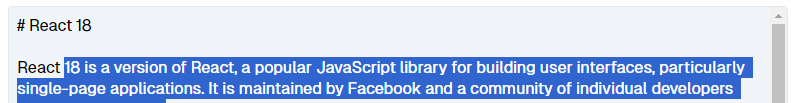

# Excercise 4

Onderdelen die we aan gaan maken:

- Article header buttons logic (article view page)
- Voeg editor toe aan `edit/[topic]/+page.svelte`
- Article header buttons logic (article edit page)
- (extra) Refactor de gedupliceerde 'load' code
- (extra) Prerendering
- (extra) Sla topics op in store en subscribe aan supabase realtime database

## Article header buttons logic (article view page)

Boven de artikelen (in view modus) staan de volgende knoppen:

- Het switchen tussen de gerenderde en raw markdown view
- Het editen van een artikel.
  - Als de gebruiker al een draft heeft, staat er "edit draft"
  - Als de gebruiker nog geen draft heeft, staat er "edit"
- (optioneel) Het verwijderen van een draft als de gebruiker die nog heeft

## Voeg editor toe aan `edit/[topic]/+page.svelte`

Voeg een textarea toe die reageert op het aantal regels in de tekst en die de draft opslaat wanneer de tekst aangepast wordt. Deze moet ook getriggerd worden vanaf het moment dat de gebruiker het artikel in edit modus opent. Maak hiervoor voldoende gebruik van reactive statements.

## Article header buttons logic (article edit page)

Boven de artikelen (in edit modus) staan de volgende knoppen:

- Het switchen tussen de gerenderde en raw markdown view
- Het verwijderen van de draft (functie wordt later geïmplementeerd)
- Het publiceren van de draft (functie wordt later geïmplementeerd)

## (Optional) Refactor de gedupliceerde 'load' code

Tussen de artikel view en edit pagina's, bestaat er een stuk gedupliceerde load code. Deze zou kunnen worden gerefactord zodat beide pagina's data uit dezelfde load functie gebruiken. _#TeachTheTeachers_

## (Optional) Prerendering

Prerender alle pagina's behalve de artikelen, want die zijn dynamisch.
