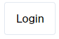
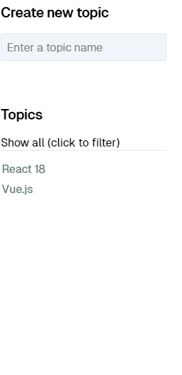
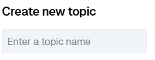

# Excercise 2

Onderdelen die we aan gaan maken:

- `store/user.ts`
- `UserButton.svelte` with store
- `TopicsList.svelte`
- `NewTopicForm.svelte`

## store/user.ts

Exporteer een `writable` in `src/lib/store/user.ts` die de meest recente user bijhoudt aan de hand van de `onUserChange` functie in de `authentication.ts` service.

## UserButton.svelte with store

Pas het component aan zodat deze op basis van de user store een login of een logout knop toont en de juiste functie uitvoert `on:click`.

## TopicsList.svelte

Maak een component dat een prop `topics: string[]` verwacht en deze als lijst weergeeft.

Boven de lijst moet een search field komen, dat een reactive statement triggered die de lijst met topics filtert op basis van een zoekterm. Het toevoegen van een nieuwe topic volgt later.

## NewTopicForm.svelte

Implementeer `NewTopicForm` zodat de gebruiker een naam kan ingeven voor een nieuw topic. Zodra er een geldige naam ingegeven wordt, wordt de knop weergegeven om deze toe te voegen. Indien de input niet geldig is, wordt er een waarschuwing getoond. Voor de validatie moet er echter gebruik gemaakt worden van het bovenliggende component om niet alle data door te moeten geven. Je kan hiervoor deze prop gebruiken: `export let isValidTopic: (topic: string) => boolean;`.

Je mag dit component gebruiken in de `TopicList`.
